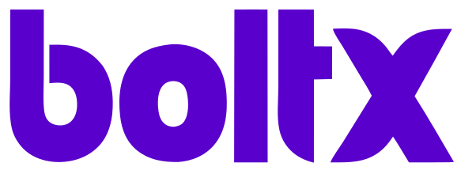

<div align="center">
  <picture>
    <source media="(prefers-color-scheme: dark)" srcset="public/images/sss.svg" />
    <source media="(prefers-color-scheme: light)" srcset="public/images/ss.svg" />
    
  </picture>
  <h1 align="center">BoltX AI</h1>
</div>

<p align="center">
  BoltX is a modern AI chat platform built for teams that need reliable, secure, and extensible conversational experiences.
  It pairs a polished end-user interface with a robust backend foundation for multi-provider AI, streaming, and persistent sessions.
</p>

<p align="center">
  <a href="#overview"><strong>Overview</strong></a> ·
  <a href="#business-value"><strong>Business Value</strong></a> ·
  <a href="#technical-highlights"><strong>Technical Highlights</strong></a> ·
  <a href="#tech-stack"><strong>Tech Stack</strong></a> ·
  <a href="#getting-started"><strong>Getting Started</strong></a>
</p>
<br/>

## Overview

BoltX provides a unified chat experience with fast streaming responses, rich artifacts (code, text, tables, images), and durable conversation state. It is designed to be provider-agnostic so teams can adopt the best model mix without rewriting product logic.

## Business Value

- **Customer support acceleration**: Deflect common tickets with fast, reliable answers and file-aware responses.
- **Internal knowledge access**: Consolidate knowledge across tools and expose it through a consistent conversational interface.
- **Productivity assistants**: Enable research, summarization, and content generation with strong UX and predictable session behavior.
- **Operational control**: Centralize model routing, usage tracking, and cost management in one platform.

## Technical Highlights

- **Provider-agnostic AI layer**: Built on the AI SDK to support multiple model providers with a consistent API surface.
- **Persistent, resumable streaming**: Sessions remain stable across network interruptions and long-running responses.
- **Artifact-aware UI**: Rich outputs (code, text, sheets, images) rendered in context for better workflows.
- **Scalable architecture**: App Router + Server Actions with clear separation between UI and inference logic.
- **Authentication and data security**: Integrated auth flows and database-backed history.

## Tech Stack

- **Framework**: Next.js 15 (App Router, Server Actions)
- **AI Infrastructure**: AI SDK 6.x
- **Styling**: Tailwind CSS v3, shadcn/ui
- **Database**: Neon Postgres
- **Caching & Persistence**: Redis (Upstash)
- **Authentication**: Auth.js

## Model Providers

BoltX supports OpenAI, DeepSeek, and any provider supported by the AI SDK. Model selection and routing are configurable through environment variables and server-side configuration.

## Getting Started

### Prerequisites

- Node.js 18+
- pnpm
- Redis instance (local or Upstash)
- Provider API keys (OpenAI, DeepSeek, or others)

### Installation

1. **Clone the repository**
   ```bash
   git clone https://github.com/sshssn/boltx.git
   cd boltX
   ```

2. **Install dependencies**
   ```bash
   pnpm install
   ```

3. **Set up environment variables**
   Copy `.env.example` to `.env.local` and fill in your keys:
   ```bash
   cp .env.example .env.local
   ```

4. **Set up the database**
   ```bash
   pnpm db:generate
   pnpm db:migrate
   ```

5. **Run the development server**
   ```bash
   pnpm dev
   ```

Open `http://localhost:3000` to view the app.

## API Endpoints

- `POST /api/chat`: Send messages and get AI responses
- `GET /api/history`: Retrieve chat history
- `POST /api/files/upload`: Upload files for processing
- `GET /api/profile/tokens`: Get user message limits

## License

MIT - Developed by ssh @AffinityX
